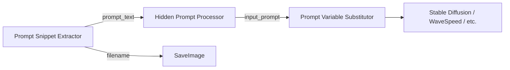

### ✅ `README.md` — `ComfyUI-prompt-utils`

# 🧠 ComfyUI Prompt Utils

[](LICENSE)
[](https://github.com/comfyanonymous/ComfyUI)

A **modular toolkit** for advanced prompt engineering in ComfyUI — designed for dataset creation, LoRA training, batch generation, and controlled variation.

✅ Extract & inject variables (`seed=123`, `model=epicrealism`)  
✅ Manage multi-prompt batches (`001_smile\n...\n---\n002_serious`)  
✅ Hide & swap variations with `[[smile;laugh;neutral]]`  
✅ Fully composable — nodes work independently or chained  

> 💡 **No external dependencies** — pure Python, works with **any model** (SDXL, Flux, Wan, LoRA, etc.).

---

## 📦 Installation

In your `ComfyUI/custom_nodes` folder:

```bash
git clone https://github.com/fmartinellidev/ComfyUI-prompt-utils.git
```

Or download as ZIP and extract into `ComfyUI/custom_nodes/ComfyUI-prompt-utils`.

Restart ComfyUI.

---

## 🧩 Included Nodes

| Node | Purpose |
|------|---------|
| **Prompt Snippet Extractor** | Split multi-prompt text into indexed snippets |
| **Prompt Variable Extractor** | Parse `key='value'` or `key="value"` from text |
| **Prompt Variable Substitutor** | Replace `{key}` placeholders with values |
| **Prompt Hidden Processor** | Swap `[[option1;option2]]` with a selected variation |

All nodes are **independent** — use one or chain them all!

---

## 🔍 Node Details

### 1. `Prompt Snippet Extractor`

Splits a multi-prompt document (e.g. for dataset generation) into indexed snippets.

#### 🔤 Inputs

| Input | Type | Required | Default | Description |
|-------|------|----------|---------|-------------|
| `prompt_list` | `STRING` | ✅ | (example) | Multi-snippet text (delimited by `---` or custom) |
| `snippet_index` | `INT` | ✅ | `0` | Which snippet to extract (0-based) |
| `split_char` | `STRING` | ✅ | `"---"` | Delimiter between snippets |
| `first_word_is_filename` | `BOOLEAN` | ✅ | `True` | Treat first word as filename source |
| `ignore_start_number_label` | `BOOLEAN` | ✅ | `True` | Strip leading numbers (e.g. `001_` → `""`) |

#### 📤 Outputs

| Output | Type | Description |
|--------|------|-------------|
| `prompt` | `STRING` | Full snippet (e.g. `"001_smile_front\nA gentle smile..."`) |
| `prompt_text` | `STRING` | Snippet without first word (e.g. `"A gentle smile..."`) |
| `filename_to_label` | `STRING` | Cleaned label (e.g. `"smile front"`) |
| `filename` | `STRING` | First word (e.g. `"001_smile_front"`) |

#### 💡 Example

**Input (`prompt_list`):**
```
001_smile_front  
A gentle smile, facing camera  
---  
002_laugh_dynamic  
Laughing joyfully, head tilted
```

**With `snippet_index=0`, `first_word_is_filename=True`, `ignore_start_number_label=True`:**

| Output | Value |
|--------|-------|
| `prompt` | `"001_smile_front\nA gentle smile, facing camera"` |
| `prompt_text` | `"A gentle smile, facing camera"` |
| `filename_to_label` | `"smile front"` |
| `filename` | `"001_smile_front"` |

---

### 2. `Prompt Variable Extractor`

Extracts `key='value'` or `key="value"` pairs from text (e.g. metadata, config).

#### 🔤 Inputs

| Input | Type | Required | Default | Description |
|-------|------|----------|---------|-------------|
| `text` | `STRING` | ✅ | `""` | Input text containing variables |
| `prefix` | `STRING` | ✅ | `"#"` | Prefix before keys (e.g. `#seed=123`) |
| `delimiter_char` | `STRING` | ✅ | `"="` | Char between key and value |

#### 📤 Outputs

| Output | Type | Description |
|--------|------|-------------|
| `output_text` | `STRING` | Text with variables removed |
| `variables_json` | `STRING` | JSON of extracted variables (e.g. `{"seed": "123"}`) |

#### 💡 Example

**Input (`text`):**  
`#seed=1234 #model="epicrealismxl" A portrait, studio lighting`

**Outputs:**
- `output_text`: `"A portrait, studio lighting"`
- `variables_json`: `{"seed": "1234", "model": "epicrealismxl"}`

---

### 3. `Prompt Variable Substitutor`

Replaces `{key}` placeholders in a template using a JSON variable map.

#### 🔤 Inputs

| Input | Type | Required | Description |
|-------|------|----------|-------------|
| `prompt_template` | `STRING` | ✅ | Template with `{key}` placeholders |
| `variables_json` | `STRING` | ✅ | JSON object (e.g. `{"seed": "123"}`) |

#### 📤 Outputs

| Output | Type | Description |
|--------|------|-------------|
| `prompt` | `STRING` | Prompt with placeholders replaced |

#### 💡 Example

**Inputs:**
- `prompt_template`: `"A {expression} portrait, {lighting} lighting"`
- `variables_json`: `{"expression": "smiling", "lighting": "soft"}`

**Output:**
- `prompt`: `"A smiling portrait, soft lighting"`

---

### 4. `Hidden Prompt Processor`

Swaps hidden variation blocks like `[[smile;laugh;neutral]]` with a selected option.

#### 🔤 Inputs

| Input | Type | Required | Default | Description |
|-------|------|----------|---------|-------------|
| `prompt` | `STRING` | ✅ | (example) | Prompt with hidden blocks |
| `input_index_split` | `INT` | ✅ | `0` | Which variation to use (0-based) |
| `delimiter_pair` | `STRING` | ✅ | `"[[ ]]"` | Block style: `[[ ]]` or `## ##` |

#### 📤 Outputs

| Output | Type | Description |
|--------|------|-------------|
| `input_prompt` | `STRING` | Prompt with hidden block replaced |
| `clean_prompt` | `STRING` | Prompt with all hidden blocks removed |

#### 💡 Example

**Input (`prompt`):**  
`A portrait of [[smile;laugh;neutral]], {lighting} lighting`

**With `input_index_split=1`, `delimiter_pair="[[ ]]"`:**

| Output | Value |
|--------|-------|
| `input_prompt` | `"A portrait of laugh, {lighting} lighting"` |
| `clean_prompt` | `"A portrait of , {lighting} lighting"` |

> 🔗 **Pro tip**: Chain with `Prompt Variable Substitutor` to replace `{lighting}` next!

---

## 🧩 Recommended Workflow



Perfect for:
- 📁 **LoRA dataset generation** (200+ expressions)  
- 🎭 **Controlled facial variation** (no random sampling)  
- 📊 **Metadata-rich outputs** (embed seed/model in filename)  

---

## 🤝 Contributions

PRs welcome! For major changes, please open an issue first.

---

Made with ❤️ by [fmartinellidev](https://github.com/fmartinellidev)  
Inspired by advanced prompt engineering needs in AI character creation.
```
